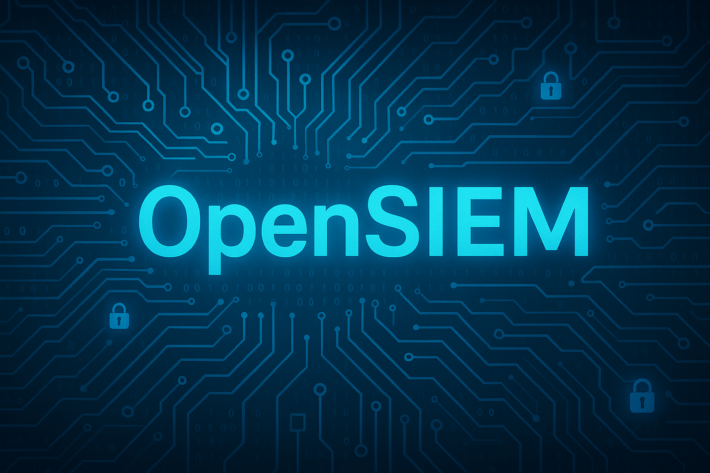

# OpenSIEM:A Unified Open Source Security Management FrameworK

## Project Overview
openSIEM is an open-source Security Information and Event Management (SIEM) solution that integrates best-in-class security tools to provide comprehensive monitoring, detection, alerting, and incident response capabilities. This project aims to make enterprise-grade security monitoring accessible to organizations of all sizes.

### Core Components
1. Wazuh: Security monitoring, threat detection and incident response
2. TheHive: Security incident response platform and case management
3. Shuffle: Security automation and orchestration
4. Elasticsearch: Search and analytics engine for security data
5. Cassandra: NoSQL database for TheHive

### Architecture
The openSIEM architecture follows a modular design with the following data flow:

Event Collection: Security events from Windows/Linux clients with Wazuh Agents
Central Processing: Events routed through centralized components
Analysis & Alerting: Automated detection and alerting
Case Management: Incident tracking and response in TheHive
Automation: Orchestrated response via Shuffle
Analyst Interface: SOC analyst dashboards and notification systems

## Quick Start
Prerequisites

Ubuntu 20.04 LTS or later
Minimum system requirements:

4 CPU cores
8GB RAM
100GB disk space

Internet connectivity for package installation

Basic Installation

Clone this repository:

bashgit clone https://github.com/FaizanMir01/openSIEM.git
cd openSIEM

Run the prerequisites installer:

bashchmod +x installation/prerequisites.sh
sudo ./installation/prerequisites.sh

Install the components:

bashsudo ./installation/thehive/install.sh
sudo ./installation/wazuh/install.sh
sudo ./installation/shuffle/install.sh

Access the web interfaces:

Wazuh: https://your-server-ip:443
TheHive: http://your-server-ip:9000
Shuffle: http://your-server-ip:3000

Default credentials can be found in the installation guides for each component.
